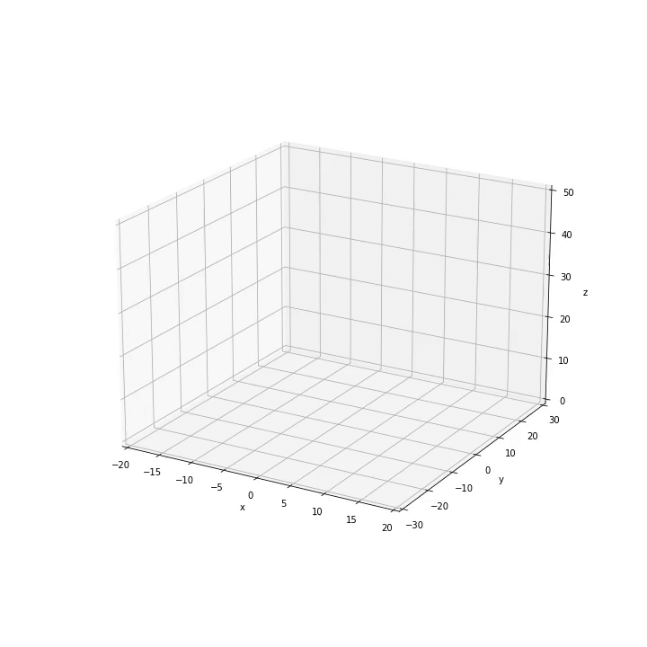

# Lorenz Attractor — Numerical Integration with Runge–Kutta 4

A Python implementation of the **Lorenz system**, numerically integrated using the classical **fourth-order Runge–Kutta (RK4) method**.

The Lorenz system is a set of three coupled nonlinear ordinary differential equations originally introduced as a simplified mathematical model of atmospheric convection. Despite its relatively simple formulation, the system exhibits deterministic chaos for particular choices of its parameters.

This project numerically evolves the system from a given initial condition and visualizes the resulting three-dimensional trajectory, including the characteristic **Lorenz attractor**.

---

## The Lorenz System

The system consists of three coupled nonlinear differential equations:

```math
\frac{dx}{dt} = \sigma (y-x)
```

```math
\frac{dy}{dt} = \rho x-y-xz
```

```math
\frac{dz}{dt} = xy-\beta z
```

where:

* $\sigma$ is related to the Prandtl number,
* $\rho$ is related to the Rayleigh number,
* $\beta$ is a geometrical parameter of the model.

The default values used in the simulation are

```math
\sigma = 10, \qquad \rho = 28, \qquad \beta = \frac{8}{3}.
```

For these parameters, the system exhibits chaotic behavior and produces the well-known Lorenz attractor.

---

## Numerical Method

The system is integrated using the classical **fourth-order Runge–Kutta method (RK4)**.

For a general system

```math
\frac{d\mathbf{x}}{dt} = \mathbf{f}(\mathbf{x}),
```

one integration step is calculated from

```math
\mathbf{k}_1 = h\,\mathbf{f}(\mathbf{x}_n)
```

```math
\mathbf{k}_2 = h\,\mathbf{f}\left(\mathbf{x}_n+\frac{\mathbf{k}_1}{2}\right)
```

```math
\mathbf{k}_3 = h\,\mathbf{f}\left(\mathbf{x}_n+\frac{\mathbf{k}_2}{2}\right)
```

```math
\mathbf{k}_4 = h\,\mathbf{f}\left(\mathbf{x}_n+\mathbf{k}_3\right)
```

and the state is updated according to

```math
\mathbf{x}_{n+1}
=
\mathbf{x}_n
+
\frac{\mathbf{k}_1+2\mathbf{k}_2+2\mathbf{k}_3+\mathbf{k}_4}{6}.
```

The timestep is

```math
h = \frac{t_{\mathrm{end}}-t_0}{N},
```

where $N$ is the number of integration intervals.

RK4 provides fourth-order accuracy for sufficiently smooth problems, making it a simple and effective method for studying the evolution of the Lorenz system.

---

## Default Simulation

The default configuration is:

| Parameter         |  Value |
| ----------------- | -----: |
| Initial $x$       |      0 |
| Initial $y$       |      1 |
| Initial $z$       |      0 |
| Initial time      |      0 |
| Final time        |     50 |
| Integration steps | 10,000 |
| $\sigma$          |     10 |
| $\rho$            |     28 |
| $\beta$           |  $8/3$ |

The corresponding initial condition is therefore

```math
(x_0,y_0,z_0)=(0,1,0).
```

---

## Chaotic Dynamics

One of the most important characteristics of the Lorenz system is its **sensitivity to initial conditions**.

For parameter combinations within the chaotic regime, two trajectories starting from extremely similar initial conditions can initially remain close but eventually evolve very differently.

This is one of the defining characteristics of deterministic chaos: the evolution is governed entirely by deterministic differential equations, but long-term prediction becomes extremely sensitive to uncertainty in the initial state.

The trajectory remains confined to a region of phase space and approaches the characteristic butterfly-shaped structure known as the **Lorenz attractor**.

---

## Running the Simulation

The project requires:

* Python 3
* NumPy
* Matplotlib
* FFmpeg

Run the simulation with

```bash
python Lorenz_Model.py
```

The parameters can also be changed directly through the `lorenz_model()` function. For example:

```python
lorenz_model(
    x0=0.0,
    y0=1.0,
    z0=0.0,
    t0=0,
    tend=50,
    N=10000,
    a=10,
    b=28,
    c=8/3
)
```

In the implementation,

```text
a = σ
b = ρ
c = β
```

---

## Visualization

As the differential equations are integrated, the program periodically stores the current three-dimensional trajectory.

These frames are subsequently combined using **FFmpeg** to produce an MP4 animation showing the progressive formation of the Lorenz attractor.

After completing the numerical integration, the program additionally generates a **360° rotation around the final trajectory**, providing a three-dimensional visualization of the attractor.

### Example



[Watch the full MP4 simulation](media/movie_lorenz_model.mp4)

---

## Repository Structure

```text
.
├── Lorenz_Model.py
├── media/
│   ├── lorenz_attractor.gif
│   └── lorenz_attractor.mp4
├── README.md
└── LICENSE
```

## Author

**Santiago Hernández Díaz**

PhD candidate in Astrophysics
University of Tübingen
